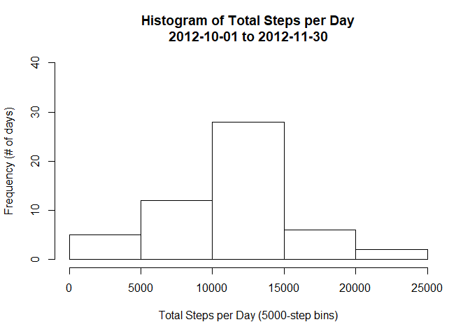
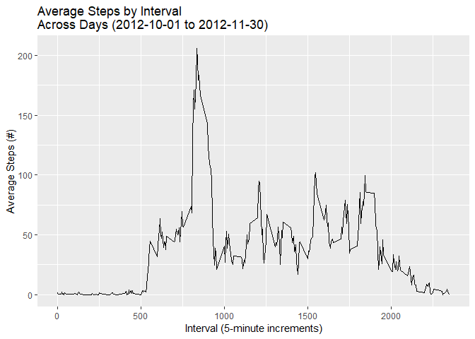
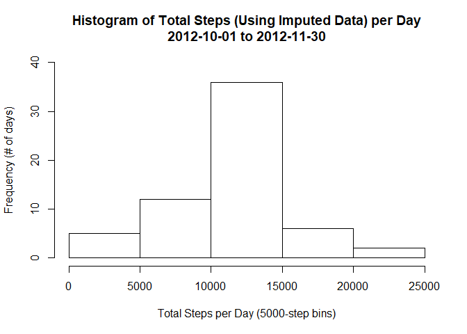
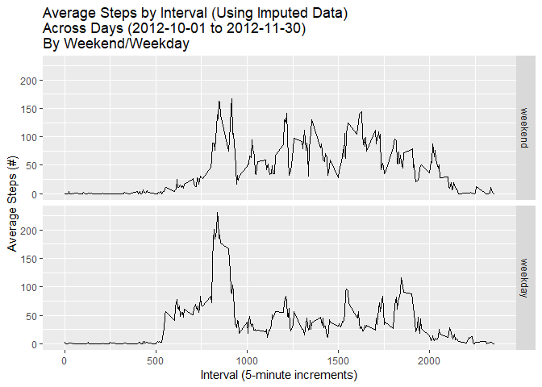

This R markdown file created to partially satisfy completion of Coursera course 
"Reproducible Research".\
**Created by David J. Bauer, 2018-11-24.**

This file appears in a Github repository that contains the assignment instructions 
and data as provided by the course instructors. The cloned repository therefore 
contains the necessary .zip data file and is set as the working directory of R. 
However, the code will download the data file if it is not present.

Note that I often set up actions to check for the existing presence of a file or 
object before running. This is because I frequently run scripts during development 
to test code (and to view the html output in this case) and I don't want to run 
time-consuming processes repeatedly. It looks messy but it's more efficient in 
the long run.

--------------------------------------------------------------------------------
--------------------------------------------------------------------------------

## A. Loading and preprocessing the data
Download the .zip data file if it is not in the working directory, then unzip the data file into a data directory and read it into an object.


```r
if(!file.exists("./activity.zip")){
        download.file("https://d396qusza40orc.cloudfront.net/repdata%2Fdata%2Factivity.zip",
                destfile = "./activity.zip")}
if(!file.exists("./data/activity.csv")){unzip("./activity.zip", exdir = "./data")}
if(!exists("activity")){activity <- read.csv("./data/activity.csv")}
```

Also load some libraries that will be used later (I like to put this stuff at the beginning). Set it so that the messages are not displayed (with message = FALSE) to reduce output clutter.


```r
library(dplyr)
library(ggplot2)
```

--------------------------------------------------------------------------------
--------------------------------------------------------------------------------

## B. What is mean total number of steps taken per day?
1. Use the aggregate function to create a data frame of total steps by day; 
label the columns appropriately.
2. Generate a decent-looking histogram of these data.
3. Calculate and report the mean and median of the total number of steps taken 
per day. Formatting the mean to set scientific as false allows for the value to
be reported without scientific notation (which looks better in this context).


```r
#Step 1
daytotals <- aggregate(activity$steps, list(activity$date), sum)
colnames(daytotals) <- c("Date","TotalSteps")

#Step 2
hist(daytotals$TotalSteps, 
     main = "Histogram of Total Steps per Day\n2012-10-01 to 2012-11-30",
     ylab = "Frequency (# of days)",   
     xlab = "Total Steps per Day (5000-step bins)",
     ylim = c(0,40))
```

<!-- -->

```r
#Step 3
daymean <- mean(daytotals$TotalSteps, na.rm = TRUE)
daymean <- format(daymean, scientific = FALSE)
daymedian <- median(daytotals$TotalSteps, na.rm = TRUE)
daymedian <- format(daymedian, scientific = FALSE)
```

### The mean total number of steps taken each day is **10766.19**.
### The median total number of steps taken each day is **10765**.

--------------------------------------------------------------------------------
--------------------------------------------------------------------------------

## C. What is the average daily activity pattern?
1. Make a time series plot (i.e. type="l") of the 5-minute interval (x-axis) and the average number of steps taken, averaged across all days (y-axis).
2. Which 5-minute interval, on average across all the days in the dataset, contains the maximum number of steps?


```r
#Step 1
#I tried to use aggregate for the means like I did above for the sums but couldn't get it to deal with NA values properly so I used dplyr instead.
intervalmeans <- activity %>% group_by(interval) %>% summarise(steps = mean(steps, na.rm = TRUE))
#Now make a quick plot using ggplot2.
qplot(interval, steps, data = intervalmeans, geom = "line", main = "Average Steps by Interval\nAcross Days (2012-10-01 to 2012-11-30)", ylab = "Average Steps (#)", xlab = "Interval (5-minute increments)")
```

<!-- -->

```r
#Step 2
maxinterval <- intervalmeans %>% filter(steps == max(steps))
```

### The 5-minute interval demonstrating the highest average number of steps taken each day is **835**, with an average of approximately **206** steps.

--------------------------------------------------------------------------------
--------------------------------------------------------------------------------

## D. Imputing missing values
1. Calculate and report the total number of missing values in the dataset (i.e. the total number of rows with NAs).
2. Devise a strategy for filling in all of the missing values in the dataset. The strategy does not need to be sophisticated. For example, you could use the mean/median for that day, or the mean for that 5-minute interval, etc.
3. Create a new dataset that is equal to the original dataset but with the missing data filled in.
4. Make a histogram of the total number of steps taken each day and Calculate and report the mean and median total number of steps taken per day. Do these values differ from the estimates from the first part of the assignment? What is the impact of imputing missing data on the estimates of the total daily number of steps?


```r
#Step 1
NAtotal <- sum(is.na(activity))
NApercentage <- format(NAtotal/nrow(activity)*100, digits = 4)

#Steps 2 & 3
#I replaced each missing step value with the mean number of steps for that 5-minute interval across days. These values were generated in the intervalmeans object. I matched the step values using the interval value, which serves as a key. Source of code help: https://stackoverflow.com/a/24847541/10500391.
imputed <- activity
imputed$steps[is.na(imputed$steps)] <- intervalmeans$steps[match(imputed$interval[is.na(imputed$steps)], intervalmeans$interval)]

#Step 4
imputedtotals <- aggregate(imputed$steps, list(imputed$date), sum)
colnames(imputedtotals) <- c("Date","TotalSteps")
hist(imputedtotals$TotalSteps, 
     main = "Histogram of Total Steps (Using Imputed Data) per Day\n2012-10-01 to 2012-11-30",
     ylab = "Frequency (# of days)",   
     xlab = "Total Steps per Day (5000-step bins)",
     ylim = c(0,40))
```

<!-- -->

```r
imputedmean <- mean(imputedtotals$TotalSteps, na.rm = TRUE)
imputedmean <- format(imputedmean, scientific = FALSE)
imputedmedian <- median(imputedtotals$TotalSteps, na.rm = TRUE)
imputedmedian <- format(imputedmedian, scientific = FALSE)
```

### The total number of rows containing NA values in the activity data set is **2304**. This is approximately **13.11%** of the rows.

### The mean total number of steps taken each day (using imputed data) is **10766.19**.
### The median total number of steps taken each day (using imputed data) is **10766.19**.

### The mean and median values do not differ meaningfully from the original values. Similarly, the histogram demonstrates the same overall pattern but is slightly more leptokurtic. This is partially due to the imputation approach I selected; other approaches could yield more discrepant results. That said, it's not entirely clear that imputing 13% of a data set is really appropriate to begin with (but it's fine as a learning exercise). 

--------------------------------------------------------------------------------
--------------------------------------------------------------------------------

## E. Are there differences in activity patterns between weekdays and weekends?

For this part the weekdays() function may be of some help here. Use the dataset with the filled-in missing values for this part.

1. Create a new factor variable in the dataset with two levels "weekday" and "weekend" indicating whether a given date is a weekday or weekend day.
2. Make a panel plot containing a time series plot (i.e. type="l") of the 5-minute interval (x-axis) and the average number of steps taken, averaged across all weekday days or weekend days (y-axis). See the README file in the GitHub repository to see an example of what this plot should look like using simulated data.


```r
#Step 1
imputed$day <- weekdays(as.Date(imputed$date))
weekdaylist <- c("Monday", "Tuesday", "Wednesday", "Thursday", "Friday")
imputed$day <- factor(imputed$day %in% weekdaylist, levels=c(FALSE, TRUE), labels=c('weekend', 'weekday'))

#Step 2
imputedmeans <- imputed %>% group_by(interval, day) %>% summarise(steps = mean(steps, na.rm = TRUE))
p <- qplot(interval, steps, data = imputedmeans, geom = "line", main = "Average Steps by Interval (Using Imputed Data)\nAcross Days (2012-10-01 to 2012-11-30)\nBy Weekend/Weekday", ylab = "Average Steps (#)", xlab = "Interval (5-minute increments)")
p + facet_grid(rows = vars(day))
```

<!-- -->

### The activity patterns differ somewhat between weekends and weekdays; based on the graph it appears as though activity typically begins a couple hours earlier on weekdays. The amplitude is also somewhat lower on weekdays from roughly 10:00 to 17:30.
